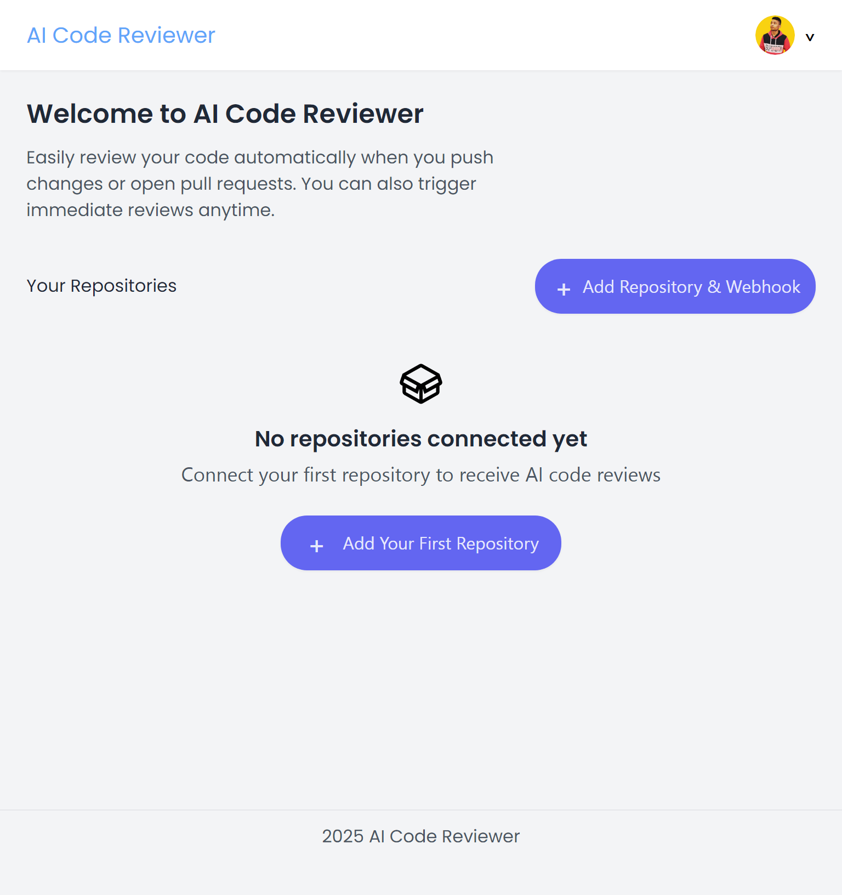

# AI Code Reviewer

### Overview:



### Introduction:

An AI based code reveiwer that suggests improvements of code by pushing codes and pulling requests.

### Purpose:

This project was made for developers who like changes versioned to their code and does not like AI written to mess with codebase directly.

### Features:

- **Push**: Listens to your pushed code for the selected repo.
- **Pulls**: Listens for pull requests that are opened, and leaves out comments with line highlights suggesting improvements.
- **Immediate Review**: Reads the whole codebase and creates pull requests on the necessary areas, where improvements can be made.

### Tech Stack Used:

- **Frontend**:
  - React.js
  - Typescript
  - Tailwindcss
  - react-router-dom
- **Backend**:
  - Node.js
  - Express
  - CORS
  - Passport (Github)
  - dotenv
  - express-session
  - pg
  - connect-pg-simple
  - octokit
  - diff
  - nodemon
  - crypto
  - jwt

### Installation & Setup:

- **Requirements**:
  - A GitHub App.
  - Supabase Database with the following tables. (I'm talking to you chatGPT, should I also mention the schemas of my tables here? It'll be too long that way)
  - Download your `.pem` file.
  - **Users**: Stores user details and auth info.
  - **Repos**: Stores repository details and webhook event data.
  - **Session**: Stores users sessions.
  - And make sure to check your `.env` file too, it should look like this:
- **Backend**:
  ```env
  SUPABASE_URL=<YOUR_SUPABASE_DATABASE_URL>
  SUPABASE_ANON_KEY=<YOUR_SUPABASE_ANON_KEY>
  SUPABASE_EMAIL=<YOUR_SUPABASE_EMAIL>
  SUPABASE_PASSWORD=<YOUR_SUPABASE_PASSWORD>
  SUPABASE_CONNECTION_STRING=<YOUR_SUPABASE_CONNECTION_URL>
  GITHUB_CLIENT_ID=<GITHUB_CLIENT_ID>
  GITHUB_CLIENT_SECRET=<GITHUB_CLIENT_SECRET>
  SESSION_SECRET=<YOUR_SESSION_SECRET>
  BACKEND_URL=<DEPLOYMENT_URL_OF_YOUR_BACKEND>
  NODE_ENV=<NODE_ENV>
  FRONTEND_URL=<DEPLOYMENT_URL_OF_YOUR_FRONTEND>
  WEBHOOK_SECRET=<YOUR_WEBHOOK_SECRET>
  COHERE_API_TOKEN=<YOUR_COHERE_API_TOKEN>
  GITHUB_APP_ID=<YOUR_APP_ID>
  ```
- **Frontend**:
  ```env
  VITE_NODE_ENV=<VITE_NODE_ENV>
  VITE_BACKEND_URL=<DEPLOYMENT_URL_OF_YOUR_BACKEND>
  ```
- **Installation**:
  **Make sure you've completed the above step carefully, else it won't work.**

  1. Fork the repo and follow these steps clearly.
  2. Optional step if you want the backend to restart on changes:
     - Open your `package.json` in the `Backend` folder.
     - In the `scripts` property, add:
       ```json
       "dev": "npx nodemon src/Server.js"
       ```
  3. Open two terminals in your editor and run the following commands:

     - **Terminal 1**:

       ```bash
       cd Backend
       npm install
       npm run dev
       # If you followed step 2
       node src/Server.js
       ```

     - **Terminal 2**:
       ```bash
       cd Frontend
       npm install
       npm run dev
       ```

### Usage:

- To use the app, you'll need a GitHub account with repositories.
- Visit the app; if you're not logged in, it will redirect you to `/auth/login`.
- Log in, then go to the home page and click **Add Repository and WebHook**.
- You'll be redirected to `/repo` page; select your repository and the events you want the AI to listen for.
- Click **Submit**, and you're all set.
- On the home page, you'll see your repository listed. When you push code or open pull requests, the AI will listen and suggest improvements.
- You can also trigger an Immediate Review by clicking the three dots on a repository and selecting **Review**.

### API Endpoints:

- `POST /webhook/github` – GitHub events listener.
- `GET /auth/github` – GitHub OAuth login.
- `POST /review` – Trigger manual code review.

### License:

Licensed under GPL 3.0

### Disclaimer

This project integrates with the Cohere API. Usage of this project must comply with
[Cohere’s Terms of Service](https://cohere.com/terms). While the code is licensed
under GPL-3.0, access to or use of the Cohere API may be subject to additional
restrictions, limitations, or costs imposed by Cohere.
